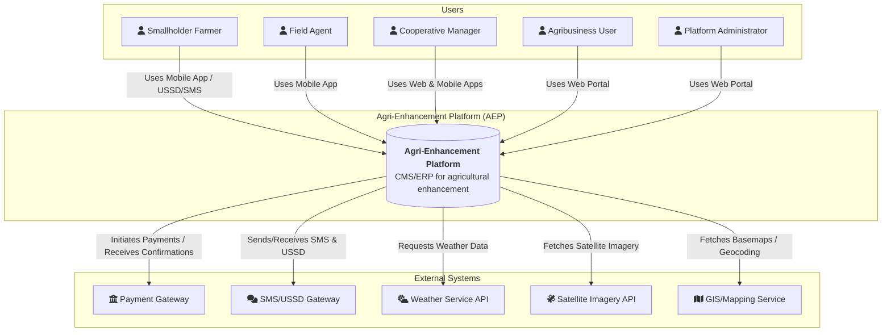
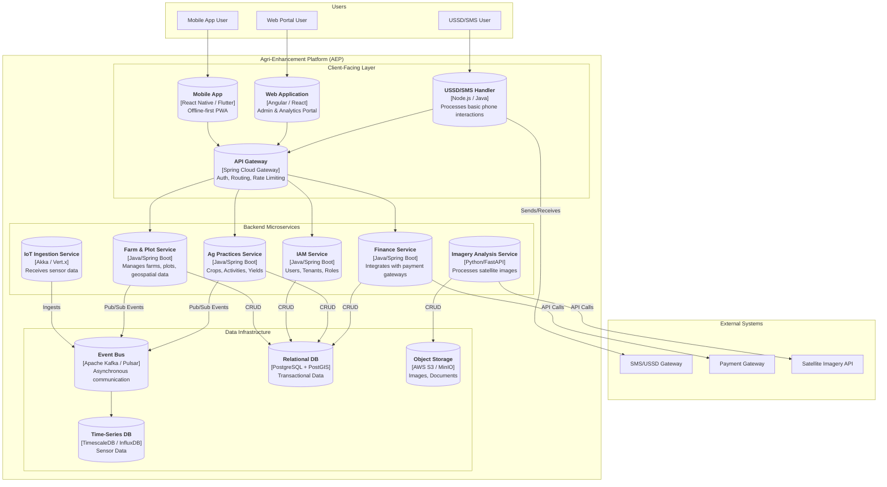

# Technical Architecture

**Architectural Style:** Distributed System using Microservices and an Event-Driven Architecture (EDA).

## System Context Diagram (C4 Level 1)

## Container Diagram (C4 Level 2)

