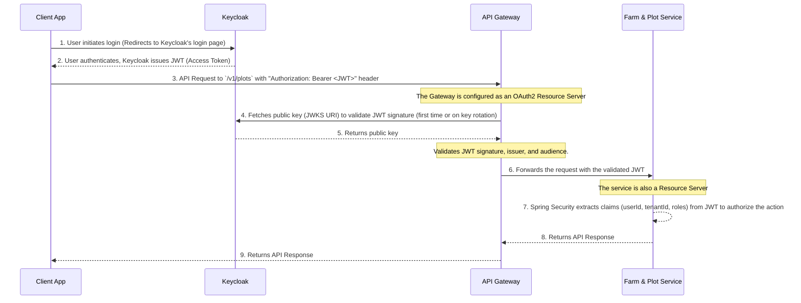

# Identity & Access Management (IAM) Service Design

This document outlines the Bounded Context, responsibilities, and high-level design for the AEP Identity & Access Management (IAM) Service, which will be built as an adapter on top of **Keycloak**.

## 1. Bounded Context & Core Responsibilities

The IAM service acts as a domain-specific adapter for Keycloak, which is the authoritative source for identity, authentication, and authorization.

*   **Keycloak's Role (The Engine):**
    *   Handles all authentication flows (OIDC/OAuth2).
    *   Securely stores user credentials.
    *   Issues and signs JWTs.
    *   Manages tenants via its **Realms** feature.

*   **IAM Service's Role (The Adapter):**
    *   **Tenant Onboarding:** Provides an API to create and configure a new Keycloak Realm for each AEP Tenant.
    *   **Domain-Specific User/Role Management:** Exposes simplified APIs (e.g., `createFieldAgentUser`) that interact with the Keycloak Admin API to manage users, roles, and groups within their respective realms.

## 2. Ubiquitous Language (Glossary)

*   **Tenant:** An isolated organizational unit within AEP, represented as a **Realm** in Keycloak. All data in the platform is partitioned by `tenantId`.
*   **User:** An individual who can log in and interact with the system. A User must belong to exactly one Tenant.
*   **Role:** A named collection of permissions that can be assigned to a User (e.g., `Cooperative Manager`, `Field Agent`, `Platform Admin`).
*   **Permission:** A granular right to perform a specific action (e.g., `CREATE_FARM`, `DELETE_PLOT`, `ASSIGN_ROLE`).
*   **JWT (JSON Web Token):** A compact, URL-safe means of representing claims to be transferred between two parties. The IAM service will issue JWTs containing `userId`, `tenantId`, and a list of assigned roles/permissions.

## 3. Core Entities & Aggregates

The domain is centered around the `Tenant` as the primary aggregate root.

*   **Tenant Aggregate:**
    *   **Aggregate Root:** `Tenant`
        *   `tenantId` (UUID)
        *   `name` (String)
        *   `status` (Enum: `ACTIVE`, `SUSPENDED`)
    *   **Entities within Aggregate:**
        *   `User`: Contains `userId`, `username`, `hashedPassword`, `firstName`, `lastName`, `status`, and a collection of assigned `Roles`.
        *   `Role`: Contains `roleId`, `name`, `description`, and a collection of associated `Permissions`.

*   **Permission (Global Entity/Value Object):**
    *   `permissionId` (UUID or Long)
    *   `name` (String, e.g., `farm:create`)
    *   `description` (String)
    *   Permissions are likely defined globally by the system, not created by tenants.

## 4. High-Level API Contract

**Authentication**
*   `POST /v1/auth/token`: **DEPRECATED.** Clients will use the standard OIDC endpoints provided directly by Keycloak.

**Tenant Management**
*   `POST /v1/tenants`: Onboard a new tenant (platform admin task).
*   `GET /v1/tenants/{tenantId}`: Get details for a specific tenant.

**User Management (scoped to a tenant)**
*   `POST /v1/tenants/{tenantId}/users`: Create a new user within a tenant.
*   `GET /v1/tenants/{tenantId}/users`: List all users for a tenant.
*   `GET /v1/tenants/{tenantId}/users/{userId}`: Get details for a specific user.
*   `PUT /v1/tenants/{tenantId}/users/{userId}`: Update a user's profile or status.
*   `POST /v1/tenants/{tenantId}/users/{userId}/roles`: Assign a role to a user.
*   `DELETE /v1/tenants/{tenantId}/users/{userId}/roles/{roleId}`: Revoke a role from a user.

**Role & Permission Management (scoped to a tenant)**
*   `POST /v1/tenants/{tenantId}/roles`: Create a new role for a tenant.
*   `GET /v1/tenants/{tenantId}/roles`: List all roles for a tenant.
*   `PUT /v1/tenants/{tenantId}/roles/{roleId}`: Update a role's name or description.
*   `POST /v1/tenants/{tenantId}/roles/{roleId}/permissions`: Grant a permission to a role.
*   `DELETE /v1/tenants/{tenantId}/roles/{roleId}/permissions/{permissionId}`: Revoke a permission from a role.

## 5. Authentication & Authorization Flow

The following diagram illustrates the standard OIDC/OAuth2 flow when a user accesses a protected API endpoint.



## 6. Multi-Tenancy Strategies: A Comparison

Keycloak offers three primary models for implementing multi-tenancy. The choice has significant implications for isolation, flexibility, and management.

### Strategy 1: Realm-per-Tenant (Recommended for AEP)

*   **Description:** Each AEP Tenant (e.g., a cooperative) is provisioned as a separate, dedicated **Realm** in Keycloak. This is our currently recommended approach.
*   **Advantages:**
    *   **Strongest Isolation:** Users, roles, permissions, and sessions are completely isolated between tenants. A breach or misconfiguration in one realm does not affect others. This is the most secure model.
    *   **Maximum Flexibility:** Each tenant can have its own unique branding, login flows, password policies, and enabled identity providers (e.g., one tenant can allow "Login with Google" while another does not).
    *   **Clear Domain Mapping:** The `Tenant` concept in our application maps cleanly and directly to the `Realm` concept in Keycloak.
*   **Disadvantages:**
    *   **No Shared Resources:** It is not possible to share roles or users directly across realms. A "Platform Admin" would need a separate account in each tenant's realm or would manage tenants from the master `admin` realm, which is a separate operational concern.
    *   **Management Overhead:** Requires robust automation within our `identity-access-service` to programmatically create and configure new realms during tenant onboarding.

### Strategy 2: Single-Realm with Organizations (A Modern Hybrid)

*   **Description:** A single Keycloak Realm is used for the entire AEP platform. Tenants are represented by **Organizations**. This feature (GA in Keycloak 24+) is designed specifically for B2B SaaS use cases.
*   **Advantages:**
    *   **Good Isolation with Shared Resources:** Provides a strong logical separation of users and resources within a single realm. It allows for defining organization-specific roles while also supporting shared, realm-level roles (like `PLATFORM_ADMIN`).
    *   **Built-in B2B Features:** Natively supports features like inviting users to an organization and organization-specific identity providers, reducing the need for custom code in our adapter service.
    *   **Simplified Management:** Less overhead than managing hundreds of realms, while still offering more structure than simple groups.
*   **Disadvantages:**
    *   **Shared Realm Configuration:** All organizations (tenants) still share the same realm-level configuration, such as password policies and top-level login themes. Customization is less than the realm-per-tenant model.
    *   **Newer Feature:** As a more recent addition, it may have fewer community resources and examples compared to the long-standing realm/group models.

### Strategy 3: Single-Realm with Groups-as-Tenants (The Legacy Alternative)

*   **Description:** A single Keycloak Realm is used for the entire AEP platform. Tenants are represented by **Groups**, and users are assigned to a group that corresponds to their tenant. A custom mapper adds a `tenant_id` claim to the JWT based on group membership.
*   **Advantages:**
    *   **Shared Global Roles:** This model excels at sharing resources. A `PLATFORM_ADMIN` role can be defined once at the realm level and assigned to users from any tenant, granting them global permissions.
    *   **Simpler Initial Setup:** Managing a single realm can feel simpler at the beginning.
*   **Disadvantages:**
    *   **Weakest Isolation:** All users exist in the same user pool. The risk of data leakage due to misconfiguration is higher. Data separation relies entirely on our application services correctly enforcing the `tenant_id` from the JWT.
    *   **Configuration Rigidity:** All tenants must share the same login theme, password policies, and identity providers. Customization per tenant is extremely limited.
    *   **Complex Authorization:** Authorization logic becomes more complex. A role like `Cooperative Manager` is meaningless without also checking that the user belongs to the correct tenant group.

### Recommendation Summary

| Feature                | Realm-per-Tenant                               | Single-Realm with Organizations                | Single-Realm with Groups                       |
| ---------------------- | ---------------------------------------------- | ---------------------------------------------- | ---------------------------------------------- |
| **Security/Isolation** | **Excellent** (Highest)                        | **Good** (Strong logical separation)           | **Fair** (Relies on application logic)         |
| **Configuration**      | **Excellent** (Total flexibility per tenant)   | **Good** (Some shared realm config)            | **Poor** (All tenants share all configs)       |
| **Shared Roles**       | **Difficult** (Requires custom federation)     | **Good** (Supports both global & tenant roles) | **Excellent** (Easiest to implement)           |
| **Management**         | **Complex** (Requires automation for realms)   | **Moderate** (Built-in org management)         | **Simple** (But can become messy at scale)     |
| **Best For**           | B2B apps needing high security & customization | **Modern B2B SaaS apps (Good default)**        | Simple apps or internal-facing platforms      |

For the **Agri-Enhancement Platform (AEP)**, where different cooperatives (tenants) may have vastly different needs and where data security is paramount, the **Realm-per-Tenant** strategy remains the most robust and secure choice. However, the **Single-Realm with Organizations** feature presents a very compelling modern alternative that we should strongly consider, as it balances isolation with easier management of shared resources. The legacy "Groups-as-Tenants" model is not recommended for our use case.

## 7. Migration Analysis: From Organizations to Realms

Starting with the "Single-Realm with Organizations" model offers benefits for rapid development, but migrating to a "Realm-per-Tenant" model later is a complex task. Here is an analysis of the risks and difficulties involved.

### Migration Steps

A high-level migration plan would look like this:
1.  **Develop Automation:** Create robust scripts (likely using the Keycloak Admin API via our `identity-access-service`) to perform the following actions for each organization:
    *   Create a new, empty realm.
    *   Configure the new realm with the required clients, roles, and identity providers.
    *   Export users from the source organization.
    *   Transform and import the users into the new realm, ensuring their roles and attributes are mapped correctly.
2.  **Plan Downtime:** Schedule a maintenance window for the migration. Live migration is extremely difficult to achieve without data inconsistencies.
3.  **Execute Migration:** Run the automated scripts for each tenant.
4.  **Update Application Configuration:** All microservices (like `farm-plot-service`) and the API Gateway must be updated. Their `issuer-uri` configuration will need to change from a static realm URL to a dynamic one, likely resolved based on the tenant context of the incoming request (e.g., via a subdomain or a path segment).
5.  **User Re-authentication:** Upon their next login attempt, users will be hitting a new realm. This will invalidate their old sessions and refresh tokens, forcing them to log in again.

### Risks and Difficulties

| Category                  | Risk/Difficulty                                                                                                                                                           | Mitigation Strategy                                                                                                                                                           |
| ------------------------- | ------------------------------------------------------------------------------------------------------------------------------------------------------------------------- | ----------------------------------------------------------------------------------------------------------------------------------------------------------------------------- |
| **Data Migration**        | **High.** User IDs might change during import. Passwords cannot be migrated directly; users might need to reset them. Custom user attributes or role mappings could be lost if not handled carefully. | Build comprehensive export/import scripts with thorough testing on staging environments. Implement a "force password reset" flow for users after migration.                     |
| **Application Downtime**  | **High.** The migration process for all tenants will require scheduled downtime. The duration depends on the number of tenants and users.                                    | Communicate clearly with users about the scheduled maintenance. Perform the migration during off-peak hours. Automate and rehearse the process to minimize the time required. |
| **Configuration Changes** | **Medium.** Every microservice and client application needs to be updated to handle dynamic realm resolution. This is a significant change from a single, static issuer URI. | Design services from the start with a configuration layer that can easily switch between static and dynamic issuer resolution. Use a centralized configuration server.      |
| **Token Invalidation**    | **Medium.** All active JWTs and refresh tokens will become invalid post-migration, logging out all active users.                                                             | This is an unavoidable consequence. Inform users that they will need to log in again after the maintenance window.                                                          |
| **Automation Complexity** | **High.** The scripts to automate realm creation, configuration, and user migration must be flawless to avoid data loss or security misconfigurations.                     | Dedicate significant development and testing effort to the migration tooling. The `identity-access-service` would be the core component responsible for this.               |

### Conclusion on Migration

While starting with the "Organizations" model is faster, migrating to "Realm-per-Tenant" is a **high-effort, high-risk** project. It should be undertaken only if the business requirements for full tenant isolation and customization become critical and cannot be met within the single-realm model. If there is a strong possibility that we will need the Realm-per-Tenant model in the future, it is architecturally safer to start with it, despite the higher initial development cost.

## 8. Migration Analysis: From Realms to Organizations

Migrating from a "Realm-per-Tenant" model to a "Single-Realm with Organizations" model involves consolidating multiple isolated environments into one. This is typically done to simplify management or enable cross-tenant features.

### Migration Steps

1. **Prepare the Target Realm:** Create and configure a single, new "master" realm that will house all tenants as organizations. Enable the "Organizations" feature for this realm.
2. **Develop Automation:** Create robust scripts to perform the following for each source realm (tenant):
    * Create a corresponding **Organization** in the new master realm.
    * Export users, roles, and clients from the source realm.
    * Transform and import the users into the master realm, ensuring they are correctly associated with their new organization. This step is critical for avoiding username collisions.
    * Re-create tenant-specific roles within the new organization's scope.
3. **Plan Downtime:** Schedule a maintenance window. Consolidating data from multiple sources carries a high risk of collision and inconsistency.
4. **Execute Migration:** Run the automated scripts for each source realm.
5. **Update Application Configuration:** All microservices and client applications must be updated to point to the single, new `issuer-uri` of the master realm.
6. **User Re-authentication:** As with the other migration path, all user sessions and tokens will be invalidated, forcing a new login.

### Risks and Difficulties

| Category                  | Risk/Difficulty                                                                                                                                                             | Mitigation Strategy                                                                                                                                                             |
| ------------------------- | --------------------------------------------------------------------------------------------------------------------------------------------------------------------------- | ------------------------------------------------------------------------------------------------------------------------------------------------------------------------------- |
| **Data Consolidation**    | **Very High.** The primary risk is **username collision**, as usernames are unique per realm but may not be unique across the entire platform. Handling this requires a clear strategy (e.g., prefixing usernames, forcing users to choose new ones). | Define a clear username collision strategy before migration. The migration script must handle this transformation. Communicate any username changes clearly to affected users. |
| **Configuration Merging** | **High.** Each realm could have different password policies, login flows, and themes. These must be consolidated into a single, unified policy for the new master realm. This may be a breaking change for some tenants. | Analyze all source realm configurations to define a common denominator policy that is acceptable for all tenants. Communicate policy changes to tenant administrators.        |
| **Role & Permission Loss**| **High.** Realm-specific roles and their fine-grained permissions must be carefully recreated within the new organization structure. There is a high risk of mis-mapping permissions, leading to security vulnerabilities. | Scripts must meticulously map old realm roles to new organization-specific roles. Perform extensive post-migration testing to verify access controls for each tenant.        |
| **Application Downtime**  | **High.** The consolidation process is complex and requires scheduled downtime.                                                                                              | Similar to the other path: communicate clearly, automate and rehearse the process, and perform the migration during off-peak hours.                                          |

### Conclusion on Migration

Migrating from a highly isolated "Realm-per-Tenant" model to a consolidated "Single-Realm with Organizations" model is arguably **more complex and riskier** than the reverse. The primary challenges are data collision (especially usernames) and the loss of tenant-specific configurations. This path should only be considered if there is a compelling business driver to unify tenants under a single set of policies and enable broad cross-tenant collaboration that cannot be achieved otherwise.

### Final Recommendation: Start with Realm-per-Tenant

Based on this analysis, the recommended approach for AEP is to **start with Strategy 1: Realm-per-Tenant**.

**Justification:**

1. **Maximum Security and Isolation:** This is the primary driver. For a platform handling sensitive agricultural and financial data, the strong isolation provided by separate realms is the most secure foundation. A breach or misconfiguration in one tenant's environment cannot affect others.

2. **Long-Term Flexibility:** As AEP grows, tenants will have diverse needs (e.g., custom branding, different identity providers, unique password policies). The Realm-per-Tenant model is the only one that supports this level of customization, ensuring the platform can adapt to future market demands.

3. **Mitigation of Future Migration Risk:** Our analysis shows that migrating from a consolidated model (Organizations) to an isolated one (Realms) is a high-risk, high-effort endeavor. It is architecturally safer and more cost-effective in the long run to start with the more robust model.

4. **Clear Domain Mapping:** The one-to-one mapping between our "Tenant" concept and Keycloak's "Realm" concept creates a clean, understandable architecture that is easier to maintain.

**Addressing the Disadvantages:**

* **Management Overhead:** This will be addressed by building automation for realm creation and configuration as a core feature of our `identity-access-service`.
* **Global Roles:** The `PLATFORM_ADMIN` role will be managed operationally from Keycloak's master `admin` realm, which is a standard and secure pattern for this type of administration.


## 9. Conceptual Data Model (SQL DDL)

The primary data store for users, roles, and credentials will be **Keycloak's internal database**.

The `identity-access-service` may maintain a small local database for caching or storing metadata related to tenant (realm) configuration, but it will not store user credentials. For example:

```sql
CREATE TABLE tenants (
    tenant_id UUID PRIMARY KEY,
    name VARCHAR(255) NOT NULL,
    keycloak_realm_id VARCHAR(255) NOT NULL UNIQUE, -- The ID of the corresponding Keycloak Realm
    status VARCHAR(50) NOT NULL,
    created_at TIMESTAMPTZ NOT NULL DEFAULT NOW(),
    updated_at TIMESTAMPTZ NOT NULL DEFAULT NOW()
);
```